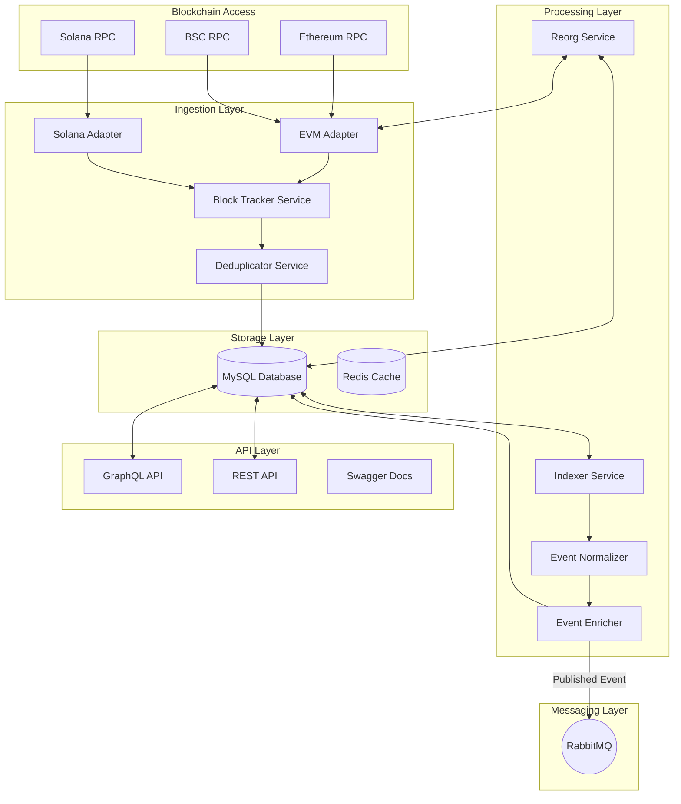

# System Architecture

This document outlines the high-level architecture of the Multi-Chain Event Indexer.

## Professional Overview

The system is a modular, event-driven indexing engine designed to aggregate data from multiple heterogeneous blockchains (EVM, Solana, etc.) into a unified queryable interface. It leverages **RabbitMQ** for reliable, asynchronous event streaming.

## Component Diagram

## Core Modules

### 1. Ingestion Layer (`src/ingestion`)
Responsible for monitoring the "safe" head of each blockchain.
- **Block Tracker**: A cron-based service that polls for new blocks.
- **Adapters**: Abstract the differences between EVM and Non-EVM chains.
- **Output**: Writes raw, unprocessed events to MySQL.

### 2. Processing Layer (`src/indexer`)
Transforms raw blockchain data into meaningful application data.
- **Indexer Service**: Polling worker that picks up `is_processed=false` events.
- **Normalizer**: Converts opaque hex data into human-readable JSON using ABI/IDL.
- **Enricher**: Adds external context (e.g., token prices, contract metadata).
- **Messaging**: Publishes successfully indexed events to **RabbitMQ** for downstream consumers (analytics, notifications).

### 3. Messaging Layer (`src/messaging`)
Handles asynchronous communication.
- **RabbitMQ**: The central message broker.
- **Exchange**: `indexer-exchange` (Topic type).
- **Routing Keys**: `event.<type>` (e.g., `event.transfer`, `event.approval`).

### 4. Integrity (Reorg Handling) (`src/reorg`)
Maintenance service that verifies the integrity of the indexed data.
- Continuously compares local block hashes with the latest RPC state.
- Automatically marks affected data as `is_canonical = false` if a chain split occurs.

## Data Flow (Lifecycle of an Event)

1.  **Detection**: `BlockTracker` identifies a new block range.
2.  **Persistence**: `Deduplicator` filters existing logs, and `saveEvents` writes them to `raw_events`.
3.  **Indexing**: `IndexerService` detects unprocessed records.
4.  **Enrichment**: The event is decoded (Normalized) and enriched (Enricher).
5.  **Finalization**: The enriched event is saved to `indexed_events`.
6.  **Publication**: The event is published to **RabbitMQ** for external systems.

## Deployment Architecture

The system is containerized using **Docker** and orchestrated with **Docker Compose**.

- **App Node**: Runs the NestJS application (Ingestion + Indexing + API).
- **Storage Node**: MySQL 8.0.
- **Cache Node**: Redis.
- **Broker Node**: RabbitMQ (Management Plugin enabled).
